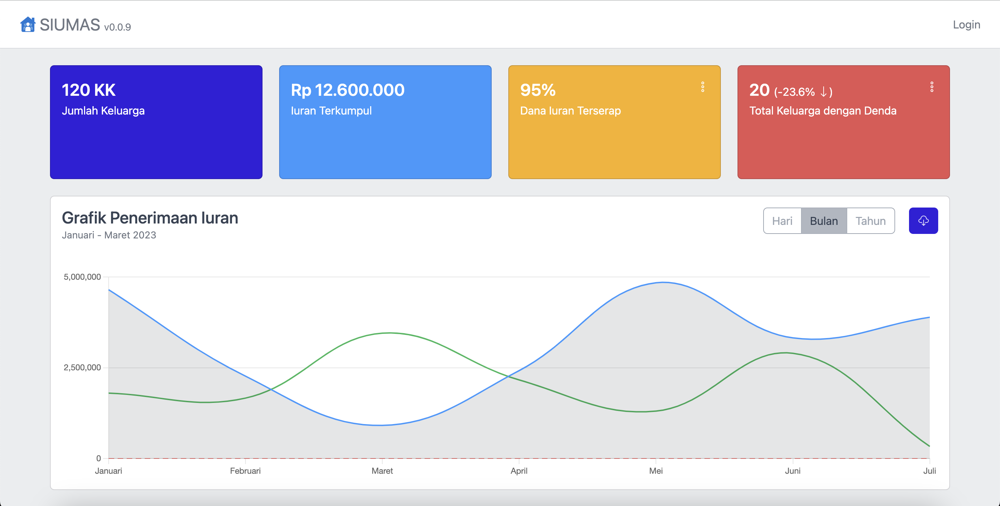
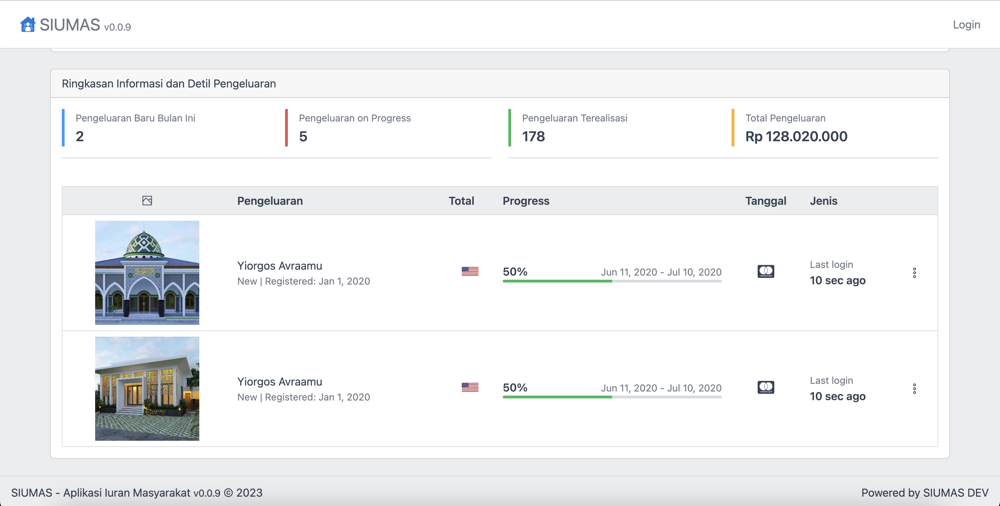
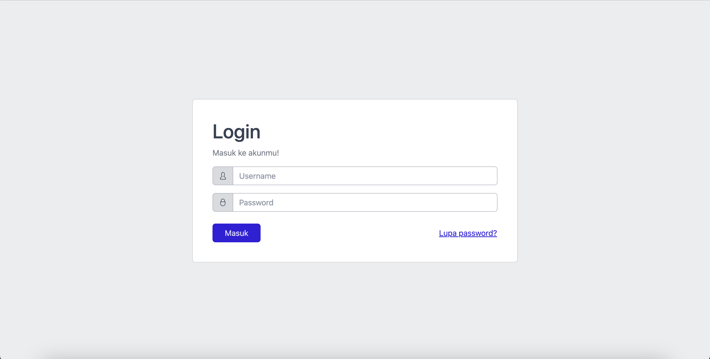
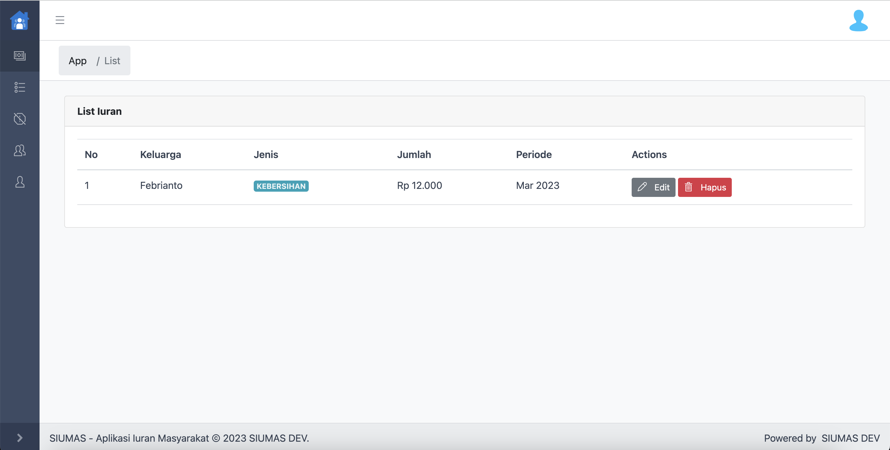
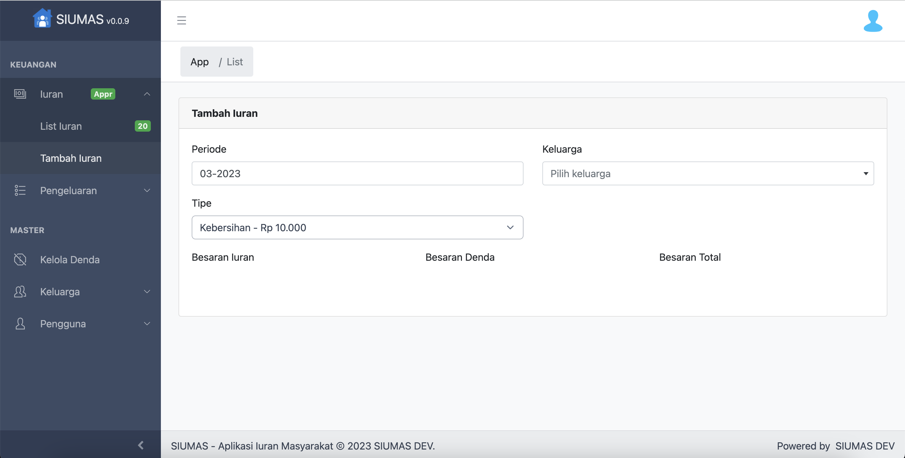

# siumas
a simple collector's app written in PHP Native

## Demo
You can see the demo version on
https://app.codeseem.com/siumas (not yet available)

## Screenshot

## Specification
- CoreUI + Bootstrap 4 + jQuery 3
- Native PHP OOP (custom View-Controller pattern framework)
- Color Palette from https://colorhunt.co/palette/06283d1363df47b5ffdff6ff
